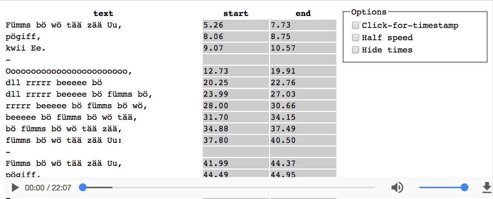
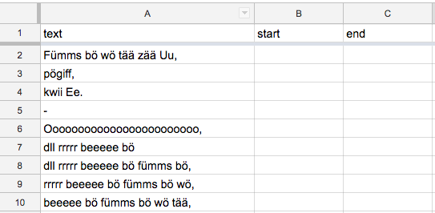

# mp3-text-sync

This page loads up an audio file and row-by-row text from a Google spreadsheet, and then allows you to either click to specify timestamps or manually edit timestamps. Thank you to [CodePunker](https://www.codepunker.com/blog/sync-audio-with-text-using-javascript) for the inspiration.

## Setup:
- Create the Google spreadsheet. It should have a "text" column, a "start" column, and an "end" column. Each row after that should have a line of text in the "text" column. You can often copy/paste text from the internet in such a way that it will get split over each row. (Sometimes it helps to paste into vim first, for whatever reason).

- Specify data in the `info` object at the bottom of `index.html`. The first item is the mp3 URL and the second item is the spreadsheet_key/worksheet_id. The spreadsheet_key is in the browser window. The worksheet_id is od6 for the first worksheet. If you need the ID for other worksheets, [read this blog post](http://damolab.blogspot.com/2011/03/od6-and-finding-other-worksheet-ids.html).
- Run [node server locally](https://github.com/indexzero/http-server). A Python simple server does not stream audio correctly, so you must use Node http-server or another server that does stream audio correctly.
- Install this [Table Capture Chrome Extension](https://chrome.google.com/webstore/detail/table-capture/iebpjdmgckacbodjpijphcplhebcmeop)
- Load localhost:8080/index.html

## Recording timestamps:
You have various options for recording timestamps. I recommend clicking "Half speed" and "Click-for-timestamp" on your first run, to get a first pass at everything.
Then, un-check "Click for timestamp" and play it back again. This time, if a time seems too early/late, you can manually edit the table cell.

When you're happy with your times, or just want to save your current work, use the Table Capture extension to copy the contents of the table back into your spreadsheet. 

## Recording a screen capture:
Once you've synced your text, you may want a video recording to share the results.
Here's what worked for me on a Mac:

- Install [Soundflower](https://github.com/mattingalls/Soundflower/releases/tag/2.0b2), following the instructions in that post to specify Soundflower as the audio source.
- Open localhost:8080. Use the options menu to hide the timestamps and zoom in as much as you'd like (300% is good). You can even delete the options menu in Chrome inspector.
- Edit in iMovie to trim or add a title.
- Upload to Youtube.

